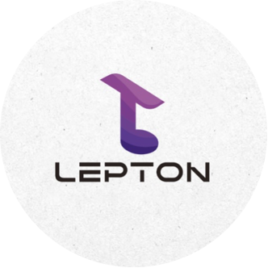
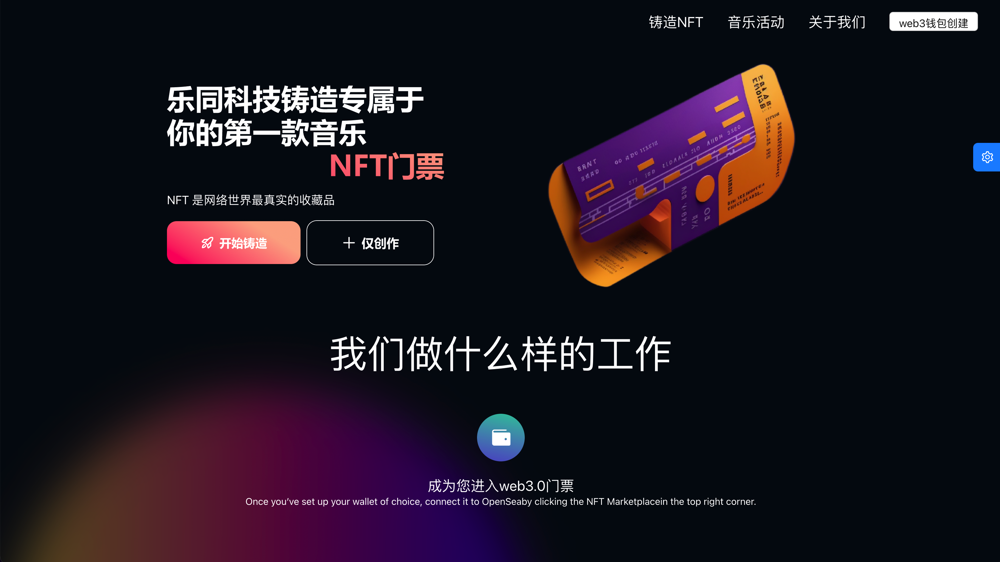
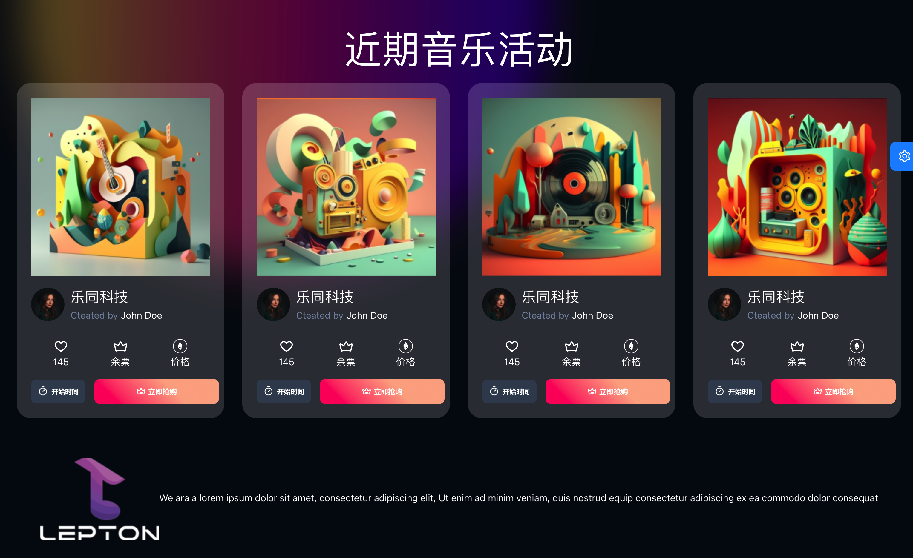
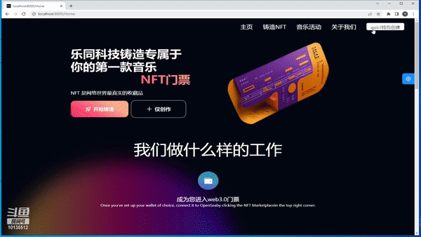

# Lepton Music NFT Demo Site

## Who are we?

**LeptonMusic is China's first “listen to earn” interactive music platform for low-threshold music copyright publication, unconditional copyright security, and maximum revenue generation for the new generation of Asian musicians. Lepton replaces the traditional copyright model with the Web 3.0 de-centralized model, and all royalty profits go to artists and listeners. The audience can listen to earn LeptonMusicCoin (LMC) and Non-Fungible Token (NFT). Based on Blockchain and Quantum Signature Technology, LeptonMusic creates a complete and vigorous system of music digital assets, including standardized music creation, publication, promotion, copyright double-protection, and trading, and benefits music industry from cryptocurrency and decentralized finance.**

**Here comes our ticket NFT program.**

## Some Thrilling Results

🌈**A bridge from the participators and the host.**

- 📓**Authority** 
- 🎨**Collectability**
- 🚀**Empowerment**





### 📹Demo Display



### 👨🏻‍💻Project Setting

```markdown


## Environment Prepare

Install `node_modules`:


npm install


or


yarn


### Start project


npm start


### Build project


npm run build


### Check code style


npm run lint


You can also use script to auto fix some lint error:


npm run lint:fix


### Test code


npm test


```


## Contact Us

[Lepton DAO](LeptonDao@163.com)
